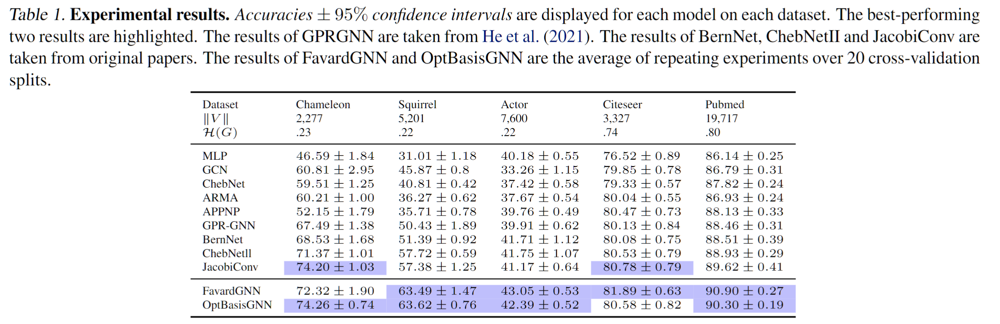
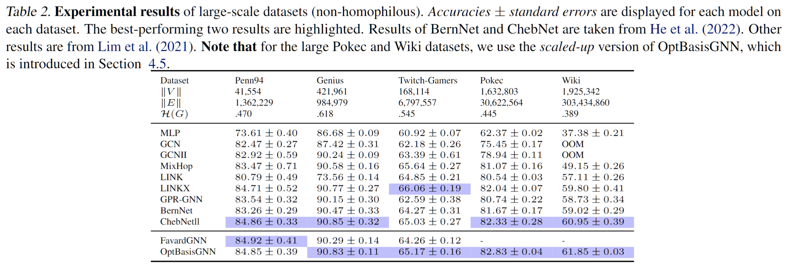
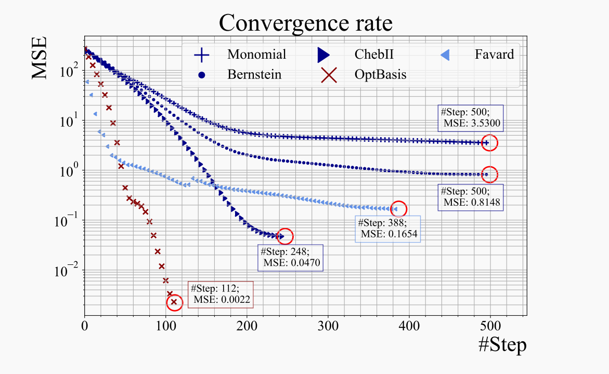

# Graph Neural Networks with Learnable and Optimal Polynomial Bases
[**Under construction**].

[\[Paper(Old Version)\]](https://arxiv.org/abs/2302.12432). 
A new version (much better written) is coming soon. Wait for ICML'23 announcement!

This repository includes the implementation for **FavardGNN** and **OptBasisGNN**, 
two spectral graph neural networks which adapts the polynomial bases for filtering. 

If you have any question about our methodology or this repository, 
please contact me or raise an issue. 


## Table of contents
1. [Requirements](#requirements)
2. [Reproducing Classification Results](#reproducing-classification-results)
    1. [On Geom-GCN datasets and Citation datasets](#reproducing-results-on-geom-gcn-datasets-tbl1)
    2. [On LINKX datasets](#reproducing-results-on-linkx-datasets-tbl2)
3. [Reproducing Regression Results](#reproducing-regression-task)
    1. [Preparations](#preparations)
    2. [Run experiments](#run-experiments)
4. [Hyperparams Tuning Scripts](#hyperparams-tuning-scripts-using-optuna)

## Requirements
[Under Construction]

## Reproducing Classification Results.
<!-- Scripts for reproducing results of our models in Table 1.  -->

### Folder structure.
Before running the experiments, 
the folder structure is as below:
```bash
.
├── cache
│   └── ckpts 
├── data
│   ├── linkx # Code From LINKX repo
├── datasets
│   ├── geom_data
│   ├── linkx
│   └── Planetoid
├── layers
├── models
├── runs 
│   └── placeholder.txt
└── utils
```

### Reproducing Results on Geom-GCN Datasets (Tbl.1).
Run scripts in the following files under `./` path.
```bash
sh> sh scripts/reproduce_favardgnn.sh
sh> sh scripts/reproduce_optbasis.sh
```



### Reproducing Results on LINKX Datasets (Tbl.2).
Run scripts in the following files under `./` path.
```bash
sh> sh scripts/reproduce_linkx.sh
```


## Reproducing Regression Task.
Shift working path to `Regression/`. 
```bash
sh> cd Regression
```

### Preparations.
**Step 1: Prepare images**

```bash
sh> unzip -d BernNetImages  BernNet-LearningFilters-image.zip
```

**Step 2: Pre-compute $U h(\Lambda) U^T$**

Pre-compute the matrix polynomials $M = U h(\Lambda) U^T = h(L)$
where $L$ is the Laplacian matrix for `100x100` grid graph, 
and $h$ corresponds to
- `High-pass` filter;
- `Low-pass` filter;
- `Band-pass` filter; 
- `Band-reject` filter. 

```bash
sh> python preprocess_matrix_polynomials.py
```
The result of this step is saved in the `save/` folder.
This step would take several hours, 
you can also 
**download** our pre-computed matrices from 
this [google drive url](https://drive.google.com/file/d/1UwNyjfTykPLhhYtW52XVJ_wexJ_LmONV/view?usp=sharing), and unzip them directly.
```bash
sh > mkdir save
sh > # Download cachedMatrices.zip and put it under ./Regresion/save/
sh> unzip save/cachedMatrices.zip -d ./save/
sh> rm ./save/cachedMatrices.zip
```

The resulted files are:
```bash
.save/
├── bandpass_Np=100.pkl
├── bandreject_Np=100.pkl
├── highpass_Np=100.pkl
└── lowpass_Np=100.pkl
```

**Step 3: Make dataset.**
```bash
sh> python make_dataset.py
```
The result of this step is a pickle file `MultiChannelFilterDataset.pkl`.

### Run experiments.
Now we run the regression task!
At this moment, the folder structure (ignoring python files) is:
```
./Regression/
├── BernNet-LearningFilters-image.zip
├── MultiChannelFilterDataset.pkl
└── save
    ├── bandpass_Np=100.pkl
    ├── bandreject_Np=100.pkl
    ├── highpass_Np=100.pkl
    └── lowpass_Np=100.pkl
```

To reproduce *Table 5*, 
you can use the bash script below to run over all the samples.
```bash
sh> python main_all.py
```
<!--  -->


To reproduce converging curves as in *Figure 2*, 

<!--  -->
<!--  -->


you can use the following script to run one or several samples and record the losses.
```bash
sh> python main_sample.py
```

## Hyperparams-tuning scripts using Optuna
**[Under Construction]**

If you want to test FavardGNN or OptBasisGNN on *other datasets*, 
you might need the Optuna script for hyperparameter tuning. 
Contact me at guoyuhe[at]ruc[dot]edu[dot]cn. 

## Related Repos
[Under Construction]


## Cite our work
[Under Construction]